# Deep Web Crawling & Spidering

The autonomous Deep Web Spider (`DeepCrawlTool`) empowers the Cite-Mind agent to conduct deep, interconnected research across the internet. Instead of merely fetching a single URL's text content, the spider parses the Document Object Model (DOM), identifies all outbound links, and traverses them recursively.

As the spider crawls, it automatically vectorizes the content (via Ollama) and maps each visited page into the Persistent Knowledge Graph as interconnected nodes.

## 🕸️ How It Works

The crawler operates using a robust Breadth-First Search (BFS) queue algorithm to safely traverse the web:

1. **Extraction:** It fetches a given URL and strips away useless elements (e.g., `<script>`, `<style>`, `<nav>`) to isolate the pure content.
2. **Link Discovery:** It identifies all valid `<a href="...">` anchor tags, converts relative paths to absolute URLs, and de-duplicates them.
3. **Graph Injection:** It initializes the `KnowledgeGraphService`, embeds the text content via the `LLMRouter`, and saves the page as a `Source` node.
4. **Relational Mapping:** When it visits a child link, it draws a semantic `CITES` edge in the Graph connecting the parent page to the newly discovered page.
5. **Recursion:** It queues up the child links and repeats the process until it hits the `max_depth` or `max_pages` threshold.

## 🏗️ Architecture Diagram

Here is a visual representation of the Deep Crawl workflow:

```mermaid
sequenceDiagram
    participant Agent as Cite-Mind Agent
    participant Spider as DeepCrawlTool
    participant Web as Internet (HTTP)
    participant Graph as Knowledge Graph (SQLite + Vector DB)

    Agent->>Spider: execute(url="https://example.com/topic", max_depth=1)
    
    rect rgb(30, 40, 60)
        note right of Spider: Processing Parent URL
        Spider->>Web: GET https://example.com/topic
        Web-->>Spider: 200 OK (HTML DOM)
        Spider->>Spider: Parse HTML, Extract Text
        Spider->>Spider: Identify all <a href> Outbound Links
        Spider->>Graph: upsert_node("Source", url, {text, title, embeddings})
    end
    
    loop Follow Outbound Links
        rect rgb(40, 50, 70)
            note right of Spider: Processing Child URL
            Spider->>Web: GET {child_link}
            Web-->>Spider: 200 OK (HTML DOM)
            Spider->>Spider: Parse HTML, Extract Text
            Spider->>Graph: upsert_node("Source", child_link, {text, title, embeddings})
            Spider->>Graph: upsert_edge(parent_url, child_link, "CITES")
        end
    end
    
    Spider-->>Agent: {"status": "success", "nodes_injected": 6}
    Note over Agent,Graph: Agent can now seamlessly query the Knowledge Graph<br/>to analyze the entire clustered sub-tree of research!
```



## 🛡️ Safety & Safeguards

To prevent runaway processes or memory leaks, the spider enforces multiple rigid safeguards:
- **`max_depth`:** Defaults to 1. This instructs the spider to crawl the starting URL (depth 0) and exactly one layer of outbound links (depth 1).
- **`max_pages`:** Defaults to 10. A strict ceiling on the total number of pages visited. Once 10 unique pages are processed, the queue immediately terminates, regardless of remaining links.
- **Content Truncation:** If a specific webpage is overly bloated, its content is safely truncated at 8,000 characters before embedding to preserve the integrity of the Vector database.
- **Visited Sets:** The spider tracks all visited URLs in a set to ensure it never processes the same link twice or falls into a circular loop (e.g., Page A links to Page B, which links back to Page A).

## 🧠 Agent Memory UX

To ensure the AI agent can seamlessly converse with the user about the topic it just crawled without needing to blindly search the Graph or re-read the page, `DeepCrawlTool` provides the **best of both worlds** in its return structure:
- It returns the **text of the main starting URL** directly to the AI's short-term context window.
- It quietly backgrounds the massive text of all the child links directly into the database. 

This guarantees the AI has the immediate context to summarize the parent page right away, while simultaneously building the massive Knowledge Graph in the background!

## 🚀 Usage

The agent determines when to use this tool based on its orchestration prompt. However, users can actively trigger it by instructing the AI:

> *"Please use the DeepCrawlTool to spider the wikipedia page on Quantum Computing, and map all the citations into my graph."*

Alternatively, developers can use it directly via Python:

```python
from app.tools.deep_crawl import DeepCrawlTool

tool = DeepCrawlTool()
result = tool.execute(
    url="https://en.wikipedia.org/wiki/Artificial_neural_network",
    max_depth=1,
    max_pages=5
)

print(result)
# Output: {'status': 'success', 'message': 'Successfully crawled 5 pages.', 'nodes_injected': 5, ...}
```
