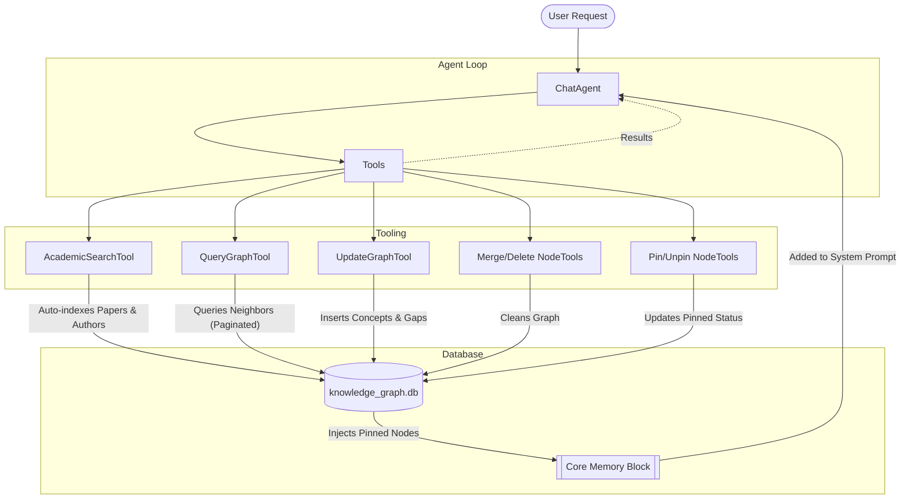

# Persistent Knowledge Graph (Cite-Mind)

The Persistent Knowledge Graph is a local, SQLite-backed memory system that allows Cite-Mind to "remember" academic papers, authors, semantic concepts, and research gaps across all conversational sessions.

Instead of acting as a stateless search engine, Cite-Mind acts as a stateful research partner, actively building a map of your research over time.

## System Architecture

## 1. Architecture & Schema

The graph is powered by a zero-dependency SQLite database located at `data/db/knowledge_graph.db`. 
It consists of two primary tables:

### `nodes`
Stores distinct entities in the research landscape.
- **id**: Primary Key
- **type**: The category of the node (e.g., `Paper`, `Author`, `Concept`, `Methodology`, `ResearchGap`).
- **name**: A unique identifier for the node (e.g., `"Attention Is All You Need"` or `"Machine Learning"`).
- **attributes**: JSON text storing additional metadata (e.g., abstract, publication year, DOI).
- **is_pinned**: Boolean flag (0 or 1) indicating if the node is currently pinned to the agent's Core Memory.

### `edges`
Stores the directional relationships between nodes.
- **id**: Primary Key
- **source_id**: Foreign Key linking to a node.
- **target_id**: Foreign Key linking to a node.
- **relation**: The type of relationship (e.g., `AUTHORED`, `CITES`, `USES`, `CONTRADICTS`, `ADDRESSES`, `SUPPORTS`).
- **attributes**: JSON text storing context (e.g., specific quotes explaining *how* it contradicts).

---

## 2. Passive Memory (Auto-Indexing)

To prevent wasting the LLM's reasoning tokens on tedious data entry, the system features a **Passive Memory** mechanism.

Whenever the `AcademicSearchTool` successfully fetches a list of papers from OpenAlex or Semantic Scholar, the `KnowledgeGraphService` automatically intercepts the results and indexes them. 
- It creates a `Paper` node.
- It creates an `Author` node for every author.
- It links them via `AUTHORED` edges.

This allows the graph to silently accumulate hundreds of foundational nodes during standard research queries.

---

## 3. Active Memory (Agent Tools)

For higher-level synthesis and mapping, Cite-Mind's LLM agent is provided with several tools to actively read and write to the graph.

* **`UpdateGraphTool`**: Allows the agent to create semantic nodes (`Concept`, `ResearchGap`, etc.) and link them to papers it has found. The tool also allows creating **standalone nodes** (e.g., when the user provides personal research notes) without linking them to a published paper. Standalone nodes are automatically pinned to Core Memory.
* **`QueryGraphTool`**: Allows the agent to query the graph for previously discovered nodes. If no query is provided, it automatically returns the 5 most recently added nodes. It returns the 1-hop neighborhood of a node. It supports `limit` and `offset` pagination to prevent large, popular nodes from blowing out the LLM's context window.

---

## 4. Core Memory Scratchpad

To allow the agent to maintain deep focus on specific topics without constantly querying the database, the system implements a "MemGPT-style" Core Memory.

* **How it works**: The system prompt injected into the LLM contains a `=== CORE MEMORY ===` block. The prompt explicitly instructs the LLM that this block represents the user's active personal context (i.e. their current projects and active research notes).
* **`PinNodeTool`**: The agent can use this tool to set `is_pinned = 1` on a node. The node's details will then automatically appear in the Core Memory block on every single conversational turn. (Standalone nodes created via `UpdateGraphTool` are pinned automatically).
* **`UnpinNodeTool`**: When the user switches research topics, the agent can unpin the node, removing it from the constant context window.

---

## 5. Self-Healing & Maintenance

Over months of usage, a knowledge graph will naturally fragment (e.g., creating both a "Machine Learning" node and an "ML" node). To combat this, the agent acts as a database administrator.

* **`MergeNodesTool`**: The agent can merge a duplicate node into a primary node. All edges pointing to or from the duplicate are transferred to the primary node, and the duplicate is deleted.
* **`DeleteNodeTool`**: The agent can prune badly formatted or entirely irrelevant nodes from the graph.

---

## Future Roadmap
- **Semantic Vector Search**: Currently, the `QueryGraphTool` relies on SQL text matching. Future versions will integrate local `sentence-transformers` to generate embeddings for nodes, allowing fuzzy-semantic retrieval (e.g., searching "Neural Nets" will retrieve the "Deep Learning" node).
- **Graph RAG Extraction**: Retrieving deeply connected subgraphs to answer complex, multi-hop questions (e.g., "Which authors disagree with Author X's methodology?").
