# Vector Search Upgrade (Graph RAG)

Cite-Mind implements a local, zero-dependency Semantic Vector Search system that upgrades the `Persistent Knowledge Graph` from a literal text-matching database into a fully semantic "Graph RAG" architecture.

## Overview

Traditional SQL databases rely on `LIKE` operators to find data. This means searching for the keyword "Cars" will completely miss a node named "Automobiles". 

To solve this, Cite-Mind uses mathematical **Vector Embeddings**. Whenever a piece of knowledge is saved, the system converts its text into a dense array of numbers (a vector) that mathematically represents its *semantic meaning*. When the agent searches the graph, it computes the geometric distance between the query's vector and the nodes' vectors.

This allows the AI to recall information conceptually, making its memory far more human-like.

### System Flow Diagram

```mermaid
sequenceDiagram
    actor Agent as ChatAgent / Tools
    participant KG as KnowledgeGraphService
    participant Router as LLMRouter
    participant Provider as OllamaProvider (nomic-embed-text)
    participant DB as SQLite (knowledge_graph.db)

    rect rgb(30, 40, 50)
    Note over Agent, DB: 1. Passive Generation (Upsert Node)
    Agent->>KG: upsert_node("Concept", "Automobiles")
    KG->>Router: generate_embedding("Concept Automobiles {...}")
    Router->>Provider: /api/embeddings POST
    Provider-->>Router: [0.012, -0.445, 0.892, ...]
    Router-->>KG: vector array
    KG->>DB: INSERT/UPDATE JSON vector into 'embedding' column
    end

    rect rgb(20, 50, 40)
    Note over Agent, DB: 2. Semantic Search (Query Graph)
    Agent->>KG: search_nodes_semantic("Cars")
    KG->>Router: generate_embedding("Cars")
    Router->>Provider: /api/embeddings POST
    Provider-->>Router: [-0.011, -0.420, 0.871, ...]
    Router-->>KG: query vector
    
    KG->>DB: SELECT id, name, embedding FROM nodes
    DB-->>KG: All nodes with embeddings
    
    loop Pure Python Processing
        KG->>KG: parse JSON to list[float]
        KG->>KG: cosine_similarity(query_vector, node_vector)
    end
    
    KG->>KG: Sort by highest score
    KG-->>Agent: Returns Top N matched GraphNodes
    end
```



---

## Architecture & Implementation

### 1. The Embedding Model (`nomic-embed-text`)
Instead of relying on external paid APIs, Cite-Mind generates embeddings locally using the `Ollama` provider.
By default, the system uses the `nomic-embed-text` model. This model is specifically designed for RAG pipelines; it is extremely fast and has a tiny memory footprint.

When the LLM Router (`app/llm/llm_router.py`) needs an embedding, it forwards the request to the `OllamaProvider.generate_embedding()` method, which hits the `/api/embeddings` endpoint.

### 2. Zero-Dependency Database Schema
Many AI projects rely on heavy 3rd-party vector databases (like ChromaDB, Pinecone, or Qdrant) or compiled SQLite extensions (like `sqlite-vss`). These are notoriously difficult to install on local machines due to C++ compilation requirements.

To keep Cite-Mind 100% portable and easy to run, vectors are stored natively inside the `knowledge_graph.db` SQLite database as serialized JSON arrays in a standard `TEXT` column:

```sql
ALTER TABLE nodes ADD COLUMN embedding TEXT
```

### 3. Pure Python Cosine Similarity
When the `QueryGraphTool` executes a semantic search, the `KnowledgeGraphService` performs the similarity calculation in pure Python using the built-in `math` principles:

1. It embeds the user's search query into a vector.
2. It fetches all stored `embedding` JSON strings from the SQLite database.
3. It computes the **Cosine Similarity** (the angle between the vectors) in memory:
   ```python
   def cosine_similarity(v1: list[float], v2: list[float]) -> float:
       dot = sum(a * b for a, b in zip(v1, v2))
       norm1 = sum(a * a for a in v1) ** 0.5
       norm2 = sum(b * b for b in v2) ** 0.5
       return dot / (norm1 * norm2)
   ```
4. It sorts the nodes by highest score and returns the top matches to the LLM.

Because personal research graphs rarely exceed a few thousand nodes, this pure Python approach executes in mere milliseconds, completely eliminating the need for heavy vector dependencies.

---

## Workflow Integration

1. **Passive Generation**: When the agent uses `UpdateGraphTool` to save a new concept or gap, the tool automatically requests an embedding for the combined text of the `node_name` and its `attributes`.
2. **Semantic Search**: When the agent uses `QueryGraphTool`, the service seamlessly falls back to semantic search, allowing the agent to ask broad, conceptual questions and still retrieve highly relevant nodes.

> [!NOTE]
> If the `OllamaProvider` is unavailable or `nomic-embed-text` is uninstalled, the `KnowledgeGraphService` will gracefully catch the failure and fall back to legacy SQL `LIKE` text matching.
