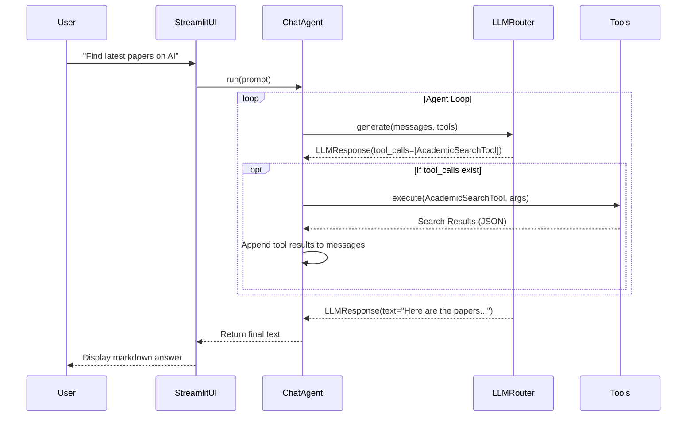

# Web Search Feature Implementation (Native Tool Calling)

We have successfully implemented **Option B (Native Tool Calling)** for Cite Mind, giving our agents the ability to autonomously search the web using both academic databases and general web search tools.

## What Was Done

1. **Tool Definitions (`app/tools/`)**
   - Created `BaseTool` interface in `app/tools/base.py` to standardize how tools declare their schema and execute.
   - Built `AcademicSearchTool` which wraps the existing `CitationLookup` service to pull peer-reviewed papers via Semantic Scholar/OpenAlex.
   - Built `WebSearchTool` which uses the `duckduckgo-search` library to provide general web querying without requiring an API key.

2. **LLM Provider Upgrades (`app/llm/`)**
   - Upgraded `BaseLLMProvider` and `LLMRouter` to support accepting `tools` and conversational `messages`.
   - Modified `GeminiProvider` and `OpenRouterProvider` to map our `BaseTool` schemas into their respective native `FunctionDeclaration` / OpenAI `tools` schemas.
   - Standardized all providers to return an `LLMResponse` object, allowing the system to easily detect if the model triggered a `tool_call`.

3. **Agent Loop Refactoring (`app/agents/`)**
   - Refactored `BaseAgent.run()` into an autonomous execution loop.
   - The agent now continuously generates responses. If the LLM requests a tool call, the agent executes the tool, appends the results to the chat history, and loops back to let the LLM generate its final response.
   - Created a new `ChatAgent` specifically designed to handle dynamic tool usage within the UI.
   - Updated `ResearchReaderAgent` to properly unpack the new `LLMResponse` structure.

4. **UI Streamlining (`app/ui/streamlit_app.py`)**
   - Replaced complex, brittle regex logic (`_is_paper_search_request`) with the new autonomous `ChatAgent`.
   - The AI will now naturally detect when a user is asking a general question, asking for a paper search, or looking for general web data, and use its tools appropriately.

## Verification

- Removed unused formatting code (`_format_paper_results`, `_paper_search_query`) from the Streamlit UI.
- Updated MockLLMs and DummyLLMs across all unit tests to ensure they return the new `LLMResponse` schema.
- All 66 tests successfully passed on `pytest`.

## How it works (Flow)

Everything is fully tested and ready to use! The system is now significantly more modular and the autonomous loop prepares Cite Mind perfectly for more complex tools in the future (like an automatic web scraping tool).
